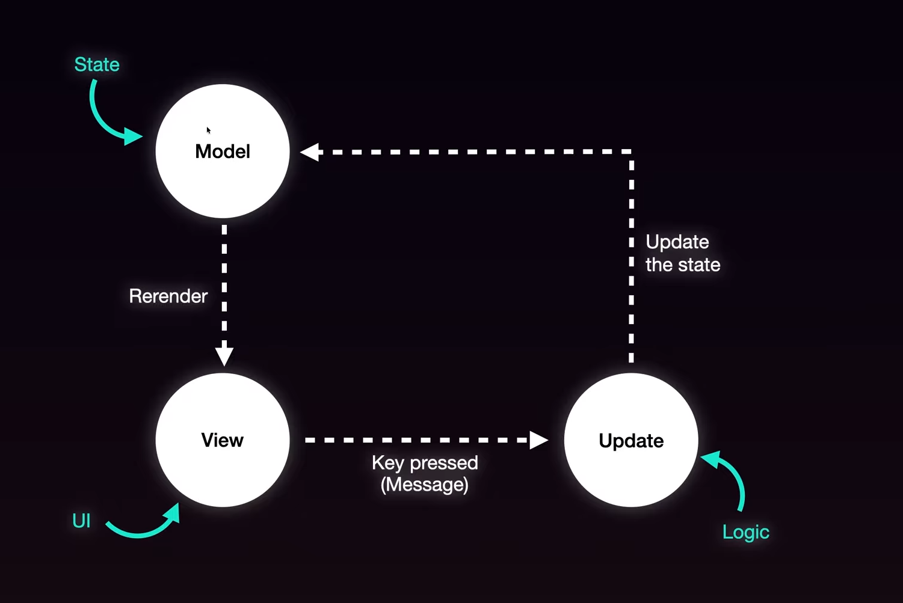

## Install Bubble Tea 
1. import in main.go
```go
import (
	tea "github.com/charmbracelet/bubbletea"
)
```
2. Run command in terminal: `go mod tidy`  
Above command download this package.


## Architecture of bubble tea
Bubble tea work on ELM architecture, it consists of 3 phase as follows
1. **Init** - a function that returns an initial command for the application to run.
2. **Update** - a function that handles incoming events and updates the model accordingly.
3. **View** -  a function that renders the UI based on the data in the model.




## Add Styling 
1. import in main.go
```go
import (
    tea "github.com/charmbracelet/bubbletea"
	 "github.com/charmbracelet/lipgloss"
)
```
